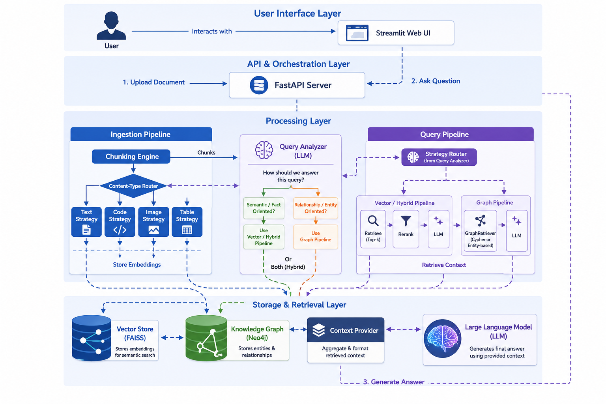

# Auto-Adaptive RAG: A Production-Ready, Multi-Modal RAG System

This project implements an advanced, auto-adaptive Retrieval-Augmented Generation (RAG) system designed for production use. It intelligently analyzes documents and queries to select the optimal processing strategy, delivering accurate, context-aware answers from a diverse range of file types.

This is not just a simple RAG pipeline; it is a sophisticated orchestration engine that combines multi-modal understanding, adaptive chunking, and dynamic retrieval strategies to tackle real-world document complexity.

## System Architecture

The system is designed around a sophisticated orchestration engine that manages the entire lifecycle of a query, from initial ingestion to final response generation.

1.  **Content-Aware Ingestion**: Documents are processed by a `ChunkingEngine` that uses content-aware strategies (e.g., for text, code, tables) to preserve semantic integrity.
2.  **Dual-Path Data Storage**: The ingestion pipeline creates two distinct data representations for retrieval:
    - **Vector Embeddings**: Content chunks are converted into vector embeddings and stored in a **Vector Store** for efficient semantic search.
    - **Knowledge Graph**: A `GraphBuilder` uses a hybrid strategy (rule-based and LLM) to extract knowledge triples from the text, which are stored in a **Neo4j Knowledge Graph**.
3.  **Intelligent Query Analysis**: Every user query is passed through a `QueryAnalyzer`. It determines the query's intent, complexity, and required content types to select the optimal retrieval strategy.
4.  **Dynamic Pipeline Execution**: Based on the analysis, the system dispatches the query to one of several specialized RAG pipelines:
    - A **Vector/Hybrid Pipeline** for semantic or keyword-based searches.
    - A **Graph Pipeline** that leverages the knowledge graph for complex, relational questions.
5.  **Synthesized Response Generation**: The selected pipeline retrieves the most relevant context from its corresponding data store, which is then used by a Large Language Model to synthesize a final, accurate answer.



## Core Features

- **Intelligent, 3-Tier PDF Ingestion**: Automatically parses complex PDFs using a fallback system: it first tries advanced, layout-aware extraction with PyMuPDF, falls back to simple text extraction, and finally uses OCR for scanned documents. This maximizes data recovery without external dependencies like Poppler.
- **Adaptive Chunking Engine**: Goes far beyond simple fixed-size chunking. It applies specialized strategies for different content types:
  - **Text**: Uses a text splitter to split text into sentence and paragraph boundaries.
  - **Code**: Employs `Tree-sitter` for syntax-aware chunking, keeping logical code blocks (functions, classes) intact.
  - **Images**: Utilizes a multi-modal Vision-Language Model (VLM) to generate detailed captions, making visual information searchable.
  - **Tables**: Processes tables as structured data to preserve their tabular context.
- **Advanced Query Analyzer**: A sophisticated `QueryAnalyzer` that determines the query's intent, complexity, and required content types, then dynamically selects the most effective retrieval pipeline.
- **Multiple Retrieval Pipelines**: 
  - **Fast Pipeline**: For simple queries, using a quick vector search.
  - **Accurate Pipeline**: For complex questions, using hybrid search (vector + keyword) and a Cross-Encoder reranker for maximum relevance.
  - **Specialized Pipelines**: Dedicated routes for `code`, `keyword`, and `structured` (table) queries.
- **Knowledge Graph & Graph-Native Reasoning**: Enables complex, multi-hop reasoning impossible for standard vector search.
  - **Hybrid Triple Extraction**: Combines fast, high-precision grammatical extraction using `spaCy` with a flexible LLM-based fallback to maximize both speed and recall.
  - **Two-Tiered Graph Retrieval**: First attempts to translate questions directly into a Cypher query for deep reasoning. If that fails, it falls back to a robust entity-based subgraph retrieval to ensure a relevant answer is always found.
- **Full Observability**: Detailed logging for every stage, from ingestion to final response generation, enabling easy debugging and performance analysis.

## What We Achieved

This project successfully evolved from a basic RAG prototype into a robust, production-ready system capable of advanced reasoning. Key achievements include:

1.  **Implemented a True Hybrid RAG System**: We went beyond simple vector search by integrating a Knowledge Graph, allowing the system to handle both semantic and relational queries.
2.  **Built a Sophisticated, Two-Tiered Graph Retrieval Engine**: The system can translate natural language into formal Cypher queries for deep, multi-hop reasoning, with a robust entity-based fallback to ensure high availability.
3.  **Developed an Intelligent Query Analyzer**: Instead of using a single, static RAG chain, the system dynamically analyzes each query and routes it to the optimal pipeline (Vector, Hybrid, or Graph), maximizing both accuracy and efficiency.
4.  **Created a Content-Aware Ingestion Pipeline**: The `ChunkingEngine` uses specialized strategies for different content types (prose, code, tables), preserving the semantic integrity of the source documents.
5.  **Pragmatic, Production-Focused Design**: Every architectural decision was made with a focus on real-world performance, scalability, and maintainability, resulting in a clean, well-tested, and documented codebase.
6.  **Established Quantitative Evaluation with Ragas**: We integrated the `ragas` framework to quantitatively measure the performance of our RAG pipeline, providing a clear, data-driven view of the system's accuracy.

## Setup and Installation

1.  **Clone the Repository:**
    ```bash
    git clone <your-repo-url>
    cd auto-adaptive-rag
    ```

2.  **Install Tesseract OCR (for Image Processing):**
    The `unstructured` library requires Tesseract for processing images and scanned PDFs. This is a system-level dependency.

    - **Windows:** Download and run the installer from the [Tesseract at UB Mannheim](https://github.com/UB-Mannheim/tesseract/wiki) page. **Important:** Add Tesseract to your system `PATH` during installation.
    - **macOS:** `brew install tesseract`
    - **Debian/Ubuntu:** `sudo apt-get install tesseract-ocr`

3.  **Create a Virtual Environment and Install Dependencies:**
    ```bash
    python -m venv venv
    source venv/bin/activate  # On Windows: venv\Scripts\activate
    pip install -r requirements.txt
    ```

4.  **Set Up Environment Variables:**
    The evaluation process now uses the Google Gemini API. You will need to provide your API key in an environment variable.

    Create a file named `.env` in the root of the project and add your API key:
    ```
    GOOGLE_API_KEY="your_google_api_key_here"
    ```

5.  **Build Code Parsing Grammars:**
    This one-time step compiles the `tree-sitter` grammars needed for intelligent code chunking.
    ```bash
    python treesitter_build/build_grammars.py
    ```

6.  **(Optional) Download NLTK Stopwords for Enhanced Keyword Search:**
    For the best keyword cleaning performance, download the NLTK stopwords list. The system will function without this, but it will use a more basic list of stopwords.
    ```bash
    python -m nltk.downloader stopwords
    ```

7.  **Download SpaCy Model for Grammatical Analysis:**
    The system uses spaCy's `en_core_web_sm` model for high-precision, rule-based triple extraction from text. This is a required dependency for the knowledge graph feature.
    ```bash
    python -m spacy download en_core_web_sm
    ```

## How to Use the System

### 1. Run the FastAPI Server

This command starts the main application. For development, it's recommended to use `uvicorn` for features like hot-reloading.

**For development (with auto-reload):**
```bash
uvicorn main:app --reload --port 8000
```

**For simple execution:**
```bash
python main.py
```

The server will be running at `http://127.0.0.1:8000`.

### 2. Run the Streamlit UI

In a separate terminal, start the Streamlit web interface.

```bash
streamlit run st_app.py
```

### 3. Upload and Process Documents

Use the "Upload Documents" section in the sidebar of the Streamlit application to upload your files. After uploading, click the "Process Uploaded Files" button to begin ingestion. You will see the processing status in the UI.

*File upload and processing status*


### 4. Ask a Question

Once your files are processed, you can ask questions using the chat input. The system will analyze your query, select the best strategy, and generate a response.

*Example of a query and its response*


### 5. Review Sources and Confidence

For each response, the system provides the source chunks it used for generation and a confidence score. This allows you to verify the accuracy of the answer and understand its origin.

*Sources and confidence score for a response*


## Evaluation

We have integrated the `ragas` framework to provide a quantitative evaluation of the RAG pipeline's performance. This allows us to measure the quality of the generated answers against a ground-truth dataset.

### Metrics

The evaluation measures the following key metrics:

- **Faithfulness**: Measures how factually consistent the generated answer is with the retrieved context.
- **Answer Relevancy**: Assesses how relevant the generated answer is to the original question.
- **Context Precision**: Evaluates whether the retrieved context was relevant and useful for answering the question.
- **Context Recall**: Measures the system's ability to retrieve all the necessary information to answer the question.

### Running the Evaluation

To run the evaluation, you first need a ground-truth dataset. This is a JSON file located at `src/evaluation/evaluation_dataset.json`. It contains a list of questions and their corresponding ideal answers.

Once the dataset is prepared, you can run the evaluation script:

```bash
python -m src.evaluation.ragas_evaluator
```

The script will run the evaluation and print the average scores for each metric.

## Configuration

Key settings can be modified in `src/config/settings.py`:

- `INGESTION_STRATEGY`: Choose the document processing backend.
  - `"unstructured"`: (Default) The modern, intelligent, structure-aware pipeline.
  - `"manual"`: The legacy pipeline with individual file loaders. Useful for benchmarking.
- `CHUNK_SIZE` / `CHUNK_OVERLAP`: Control the size and overlap of text chunks.
- `EMBED_MODEL_NAME`: Specify the embedding model to use.
- `GOOGLE_MODEL_NAME`: The name of the Google Gemini model to use for the evaluation LLM.
- `CLEAR_ON_RESTART`: Set to `True` during development to clear the vector store on each server start.

## Future Scope

This project provides a powerful foundation that can be extended in many ways:
- **Self-Correcting RAG with Feedback Loops**: Implement a "critique" step where the system evaluates its own generated answer against the source documents. If the answer is weakly supported, the system can automatically re-run the retrieval process with a refined query to improve accuracy.
- **Agentic Workflows for Complex Tasks**: Develop autonomous agents that use the RAG system as a tool to perform complex, multi-step tasks like generating summary reports, comparing documents, or monitoring information streams.
- **Advanced Evaluation Suite**: Expand the evaluation framework to continuously measure performance on metrics like answer relevance, faithfulness, and latency.

## Project Structure

```
auto-adaptive-hybrid-rag/

 src/
    api/                  # FastAPI endpoints
    chunking/             # Adaptive chunking logic
      strategies/       # Strategies for different content types
    config/               # Configuration settings
    core/                 # Core orchestration and system logic
       decision/         # Decision engine for routing
       graph/            # Knowledge graph construction and retrieval
       llm/              # Language model wrappers
       pipelines/        # RAG pipelines (fast, accurate, etc.)
       retrieval/        # Vector/hybrid retrieval and reranking logic
       strategy/         # Query analysis and strategy selection
    data/                 # Pydantic data schemas and models
    evaluation/           # Evaluation scripts and datasets
    experimental/         # Experimental features

 tests/                    # Test suite
 assets/                   # Images and other static assets
 main.py                   # FastAPI application entry point
 st_app.py                 # Streamlit UI application
 README.md                 # Project documentation
 requirements.txt          # Python dependencies
```