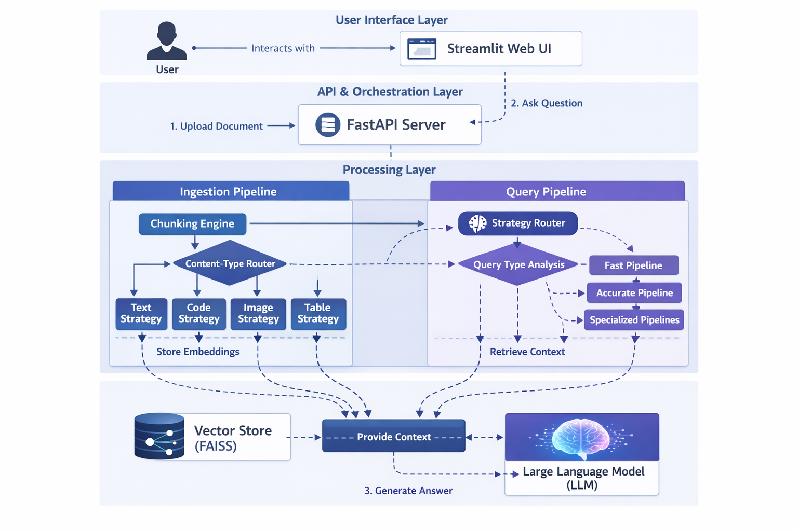
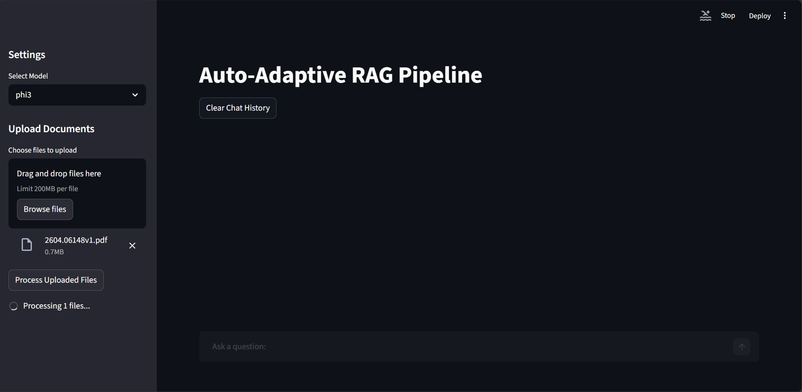
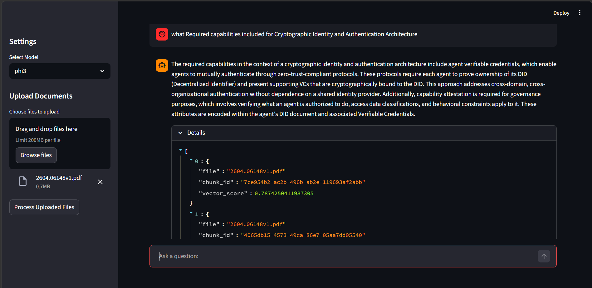
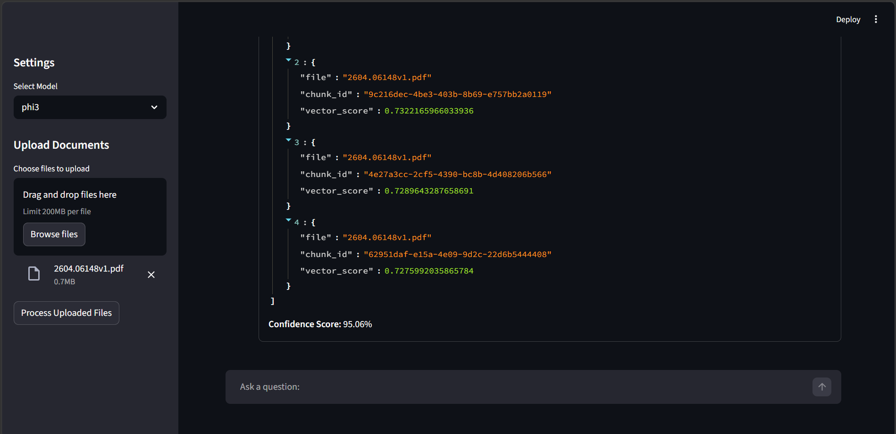

# Auto-Adaptive RAG: A Production-Ready, Multi-Modal RAG System

This project implements an advanced, auto-adaptive Retrieval-Augmented Generation (RAG) system designed for production use. It intelligently analyzes documents and queries to select the optimal processing strategy, delivering accurate, context-aware answers from a diverse range of file types.

This is not just a simple RAG pipeline; it is a sophisticated orchestration engine that combines multi-modal understanding, adaptive chunking, and dynamic retrieval strategies to tackle real-world document complexity.

## System Architecture

The system is designed around a sophisticated orchestration engine that manages the entire lifecycle of a query, from initial ingestion to final response generation.

1.  **Tiered Ingestion Pipeline**: Documents are processed through a multi-stage pipeline that extracts content based on its structure. It uses a 3-tier fallback system for PDFs (PyMuPDF's advanced layout-aware extraction, then a simple text extraction, and finally OCR for scanned images), ensuring maximum data recovery.
2.  **Adaptive Chunking**: The `ChunkingEngine` intelligently selects the best chunking strategy based on content type (text, code, tables, images), preserving the semantic integrity of the data.
3.  **Query Preprocessing**: Before retrieval, every user query is passed through a `QueryProcessor`. It creates two versions: a minimally processed version for semantic vector search and a heavily cleaned version (stopwords removed, etc.) for precise keyword search.
4.  **Dynamic Strategy Selection**: The `RAGOrchestrator` analyzes the preprocessed query to understand its intent and complexity, then selects the optimal retrieval pipeline (e.g., simple vector search, hybrid search with reranking).
5.  **Hybrid Retrieval & Synthesis**: The selected pipeline fetches relevant data chunks using a combination of semantic and keyword search, re-ranks them for relevance, and then synthesizes a final, coherent answer using a Large Language Model.



## Core Features

- **Intelligent, 3-Tier PDF Ingestion**: Automatically parses complex PDFs using a fallback system: it first tries advanced, layout-aware extraction with PyMuPDF, falls back to simple text extraction, and finally uses OCR for scanned documents. This maximizes data recovery without external dependencies like Poppler.
- **Adaptive Chunking Engine**: Goes far beyond simple fixed-size chunking. It applies specialized strategies for different content types:
  - **Text**: Uses a text splitter to split text into sentence and paragraph boundaries.
  - **Code**: Employs `Tree-sitter` for syntax-aware chunking, keeping logical code blocks (functions, classes) intact.
  - **Images**: Utilizes a multi-modal Vision-Language Model (VLM) to generate detailed captions, making visual information searchable.
  - **Tables**: Processes tables as structured data to preserve their tabular context.
- **Dual-Mode Query Processor**: A dedicated `QueryProcessor` standardizes every incoming query for the hybrid retrieval system. It generates a `normalized` version for semantic search and a `cleaned` token list for keyword search, improving retrieval accuracy.
- **Dynamic Strategy Router**: The "brain" of the system. It analyzes each user query to determine its intent, complexity, and required content types, then dynamically selects the most effective retrieval pipeline.
- **Multiple Retrieval Pipelines**: 
  - **Fast Pipeline**: For simple queries, using a quick vector search.
  - **Accurate Pipeline**: For complex questions, using hybrid search (vector + keyword) and a Cross-Encoder reranker for maximum relevance.
  - **Specialized Pipelines**: Dedicated routes for `code`, `keyword`, and `structured` (table) queries.
- **Full Observability**: Detailed logging for every stage, from ingestion to final response generation, enabling easy debugging and performance analysis.
- **Hybrid Knowledge Graph Builder**: Instead of relying solely on an LLM, the system uses a sophisticated two-tier process to extract knowledge triples from text, combining speed with high recall.
- **Graph-Native Reasoning Engine**: For complex questions, the system can translate natural language into a formal Cypher query to be executed directly on the Neo4j graph database. This enables multi-hop reasoning that is impossible with standard vector search. It includes a robust fallback to simpler graph retrieval for broader queries.

## Knowledge Graph Construction

To enable more advanced reasoning, the system can construct a knowledge graph from the ingested documents. It uses a powerful hybrid approach for triple extraction, designed to maximize both speed and accuracy. This process is orchestrated by the `KnowledgeGraphBuilder`.

The system employs a two-tier "fast path" to extract as many triples as possible *before* resorting to a more expensive, LLM-based extraction.

1.  **Tier 1: Advanced Grammatical Matching (Precision & Speed)**
    -   **Technology**: Uses `spaCy`'s powerful `DependencyMatcher`.
    -   **How it Works**: We define precise grammatical patterns (e.g., for Subject-Verb-Object and passive voice) that can be matched against the document's dependency parse tree.
    -   **Benefit**: This is extremely fast and highly accurate for common sentence structures, providing a strong baseline of high-quality triples with minimal overhead.

2.  **Tier 2: Open Information Extraction (Recall & Breadth)**
    -   **Technology**: Integrates the industry-standard `Stanford OpenIE` library.
    -   **How it Works**: This pre-trained system is designed to find a broad range of relational triples in text, even those that don't conform to simple grammatical patterns.
    -   **Benefit**: This significantly increases the *recall* of our extraction process, finding valuable relationships that a purely rule-based system would miss.

Only if these fast and efficient methods fail to extract meaningful triples from a text chunk does the system fall back to using a Large Language Model, ensuring that our most expensive resources are used only when necessary.

## What We Achieved

This project successfully evolved from a basic RAG prototype into a robust, production-ready system. Key achievements include:

1.  **Robust PDF & Query Handling**: We implemented a tiered PDF ingestion system that gracefully handles complex documents and a query processor that optimizes user input for hybrid search.
2.  **Eliminated Over-Engineering**: We systematically removed complex, unnecessary components (like the `SemanticSplitter` and `Adjudicator`) in favor of a more direct and powerful architecture.
3.  **Unified Ingestion Pipeline**: We replaced a clunky, manual system of individual file loaders with a single, elegant `ChunkingEngine` powered by `unstructured` and a factory of specialized chunking strategies.
4.  **Intelligent Content-Aware Processing**: The system no longer treats all content as plain text. It understands the difference between prose, code, tables, and images, and processes each accordingly.
5.  **Pragmatic, Production-Focused Design**: Every architectural decision was made with a focus on real-world performance, scalability, and maintainability.

## Setup and Installation

1.  **Clone the Repository:**
    ```bash
    git clone <your-repo-url>
    cd auto-adaptive-rag
    ```

2.  **Install Tesseract OCR (for Image Processing):**
    The `unstructured` library requires Tesseract for processing images and scanned PDFs. This is a system-level dependency.

    - **Windows:** Download and run the installer from the [Tesseract at UB Mannheim](https://github.com/UB-Mannheim/tesseract/wiki) page. **Important:** Add Tesseract to your system `PATH` during installation.
    - **macOS:** `brew install tesseract`
    - **Debian/Ubuntu:** `sudo apt-get install tesseract-ocr`

3.  **Create a Virtual Environment and Install Dependencies:**
    ```bash
    python -m venv venv
    source venv/bin/activate  # On Windows: venv\Scripts\activate
    pip install -r requirements.txt
    ```

4.  **Build Code Parsing Grammars:**
    This one-time step compiles the `tree-sitter` grammars needed for intelligent code chunking.
    ```bash
    python treesitter_build/build_grammars.py
    ```

5.  **(Optional) Download NLTK Stopwords for Enhanced Keyword Search:**
    For the best keyword cleaning performance, download the NLTK stopwords list. The system will function without this, but it will use a more basic list of stopwords.
    ```bash
    python -m nltk.downloader stopwords
    ```

6.  **Download SpaCy Model for Grammatical Analysis:**
    The system uses spaCy's `en_core_web_sm` model for high-precision, rule-based triple extraction from text. This is a required step for the knowledge graph construction feature.
    ```bash
    python -m spacy download en_core_web_sm
    ```

## How to Use the System

### 1. Run the FastAPI Server

This command starts the main application. For development, it's recommended to use `uvicorn` for features like hot-reloading.

**For development (with auto-reload):**
```bash
uvicorn main:app --reload --port 8001
```

**For simple execution:**
```bash
python main.py
```

The server will be running at `http://127.0.0.1:8001`.

### 2. Run the Streamlit UI

In a separate terminal, start the Streamlit web interface.

```bash
streamlit run st_app.py
```

### 3. Upload and Process Documents

Use the "Upload Documents" section in the sidebar of the Streamlit application to upload your files. After uploading, click the "Process Uploaded Files" button to begin ingestion. You will see the processing status in the UI.

*File upload and processing status*


### 4. Ask a Question

Once your files are processed, you can ask questions using the chat input. The system will analyze your query, select the best strategy, and generate a response.

*Example of a query and its response*


### 5. Review Sources and Confidence

For each response, the system provides the source chunks it used for generation and a confidence score. This allows you to verify the accuracy of the answer and understand its origin.

*Sources and confidence score for a response*


## Configuration

Key settings can be modified in `src/config/settings.py`:

- `INGESTION_STRATEGY`: Choose the document processing backend.
  - `"unstructured"`: (Default) The modern, intelligent, structure-aware pipeline.
  - `"manual"`: The legacy pipeline with individual file loaders. Useful for benchmarking.
- `CHUNK_SIZE` / `CHUNK_OVERLAP`: Control the size and overlap of text chunks.
- `EMBED_MODEL_NAME`: Specify the embedding model to use.
- `CLEAR_ON_RESTART`: Set to `True` during development to clear the vector store on each server start.

## Future Scope

This project provides a powerful foundation that can be extended in many ways:
- **Self-Correcting RAG with Feedback Loops**: Implement a "critique" step where the system evaluates its own generated answer against the source documents. If the answer is weakly supported, the system can automatically re-run the retrieval process with a refined query to improve accuracy.
- **Agentic Workflows for Complex Tasks**: Develop autonomous agents that use the RAG system as a tool to perform complex, multi-step tasks like generating summary reports, comparing documents, or monitoring information streams.
- **Advanced Evaluation Suite**: Expand the evaluation framework to continuously measure performance on metrics like answer relevance, faithfulness, and latency.

## Project Structure

```
auto-adaptive-hybrid-rag/

 src/
    api/                  # FastAPI endpoints
    chunking/             # Adaptive chunking logic
      strategies/       # Strategies for different content types (text, code, image)
    config/               # Configuration settings
    core/                 # Core orchestration and system logic
       decision/         # Decision engine for routing
       llm/              # Language model wrappers
       pipelines/        # RAG pipelines (fast, accurate, etc.)
       retrieval/        # Retrieval and reranking logic
       strategy/         # Query analysis and strategy selection
      query_processor.py  # Query normalization and cleaning
    data/                 # Data schemas and models
      ingestion/        # Document loading and parsing
    evaluation/           # Evaluation scripts and datasets
   experimental/         # Experimental features

 tests/                    # Test suite
 assets/                   # Images and other static assets
 main.py                   # FastAPI application entry point
 st_app.py                 # Streamlit UI application
 README.md                 # Project documentation
requirements.txt          # Python dependencies
```